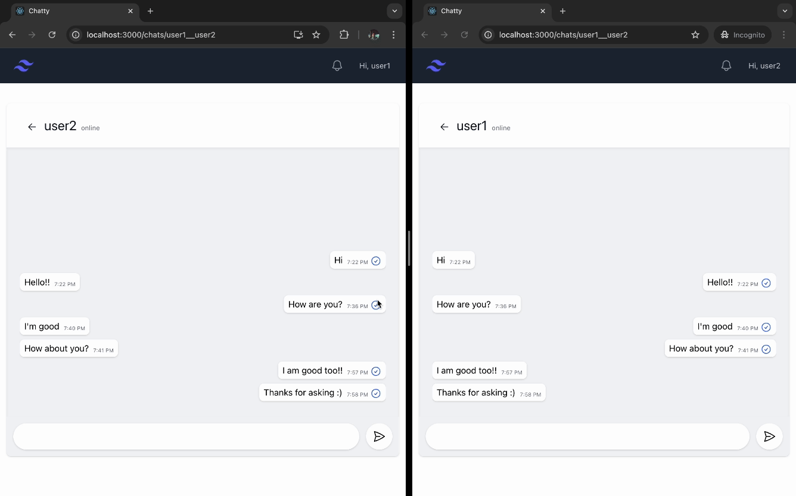

# Chatty


## Table of Contents

- [Introduction](#introduction)
- [Features](#features)
- [Installation](#installation)
- [Usage](#usage)
- [Screenshots](#screenshots)
- [Technologies Used](#technologies-used)
- [Contributing](#contributing)
- [Contact](#contact)

## Introduction

Welcome to the Chatty! This project is a real-time chat application built using WebSockets, Django, and React.js. The
application includes essential chat features such as read receipts, delivered receipts, typing indicators, delete
messages, and last seen status.

## Features

- **Real-Time Messaging**: Instant messaging with WebSockets.
- **Read Receipts**: Know when your message has been read.
- **Typing Indicators**: See when someone is typing.
- **Delete Messages**: Delete messages from the chat history.
- **Last Seen Status**: Check when your contacts were last active.

## Installation

### Prerequisites

- Docker (https://docs.docker.com/get-docker/)

### Steps

1. Clone the repository:
    ```sh
    git clone https://github.com/Suryam26/chatty.git
    cd chatty
    ```
2. Build and run the Docker containers:
    ```sh
    docker-compose up --build
    ```

## Usage

Once the Docker containers are up and running, you can access the application at `http://localhost:3000`.

## Screenshots

### Real-Time Messaging


### Read Receipts


### Typing Indicators


### Delete Messages



### Last Seen Status


## Technologies Used

- **Frontend**: React.js
- **Backend**: Django
- **Real-Time Communication**: WebSockets
- **Database**: PostgreSQL

## Contributing

Contributions are welcome! Please follow these steps:

1. Fork the repository.
2. Create a new branch (`git checkout -b feature/YourFeature`).
3. Commit your changes (`git commit -m 'Add some feature'`).
4. Push to the branch (`git push origin feature/YourFeature`).
5. Open a Pull Request.

## Contact

For any inquiries, please contact [suryam.jain@gmail.com](mailto:suryam.jain@gmail.com).

---

**Happy Coding!**